# MeshGraphNet_Homann_results

### Description of Case Name Format:
Each case name follows the format:
`A[Angle]_In[Inlet Size]_Sym[Distance from Nozzle (mm)]_Msh[Mesh Size (mm)]_T[Inlet Temperature (°C)]_U[Inlet Velocity (m/s)]`.

- **A**: Angle (e.g., A90 means 90°)
- **In**: Inlet size (e.g., In3 means inlet size 3)
- **Sym**: Distance from nozzle in mm (e.g., Sym40 means 40mm)
- **Msh**: Mesh size in mm (e.g., Msh1 means mesh size is 1mm)
- **T**: Inlet temperature in °C (e.g., T200 means 200°C)
- **U**: Inlet velocity in m/s (e.g., U100 means 100 m/s)
- The final part of the file name represents a parameter (`p`, `u`, `v`, etc.)

---

## GIF Categories by Case Name:

### **A80_In3_Sym40_Msh1**
- **T**: 
- **alphat**: 
- **k**: 
- **nut**: 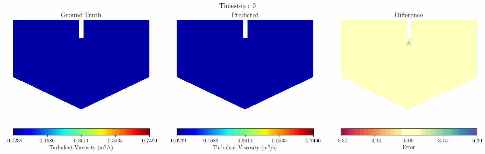
- **omega**: 
- **p**: 
- **rho**: 
- **u**: 
- **v**: 
- **w**: 

### **A86_In3_Sym46_Msh1.5_T769_U199**
- **T**: 
- **alphat**: 
- **k**: 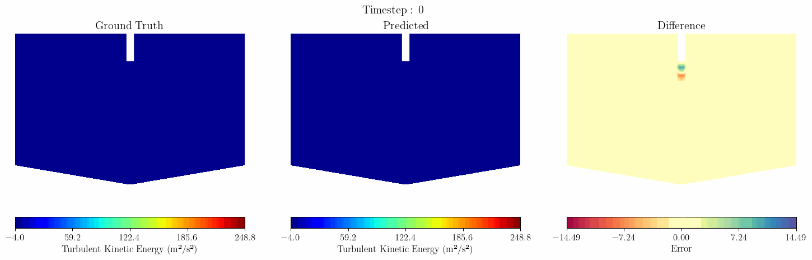
- **nut**: 
- **omega**: 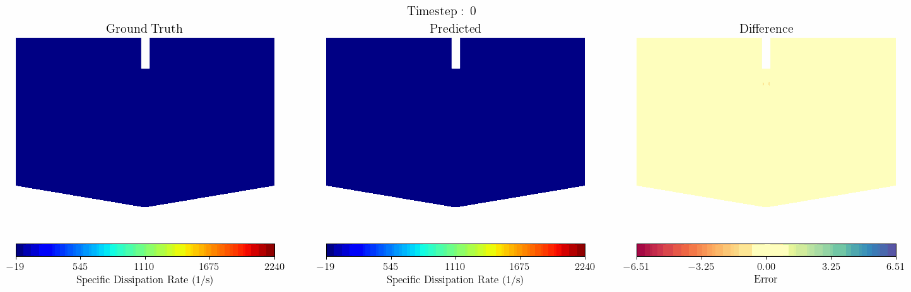
- **p**: 
- **rho**: 
- **u**: 
- **v**: 
- **w**: 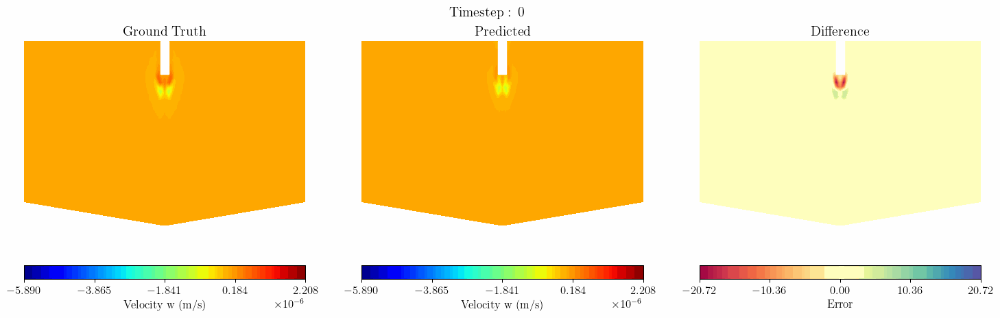

### **A87_In3_Sym57_Msh1.0_T956_U274**
- **T**: 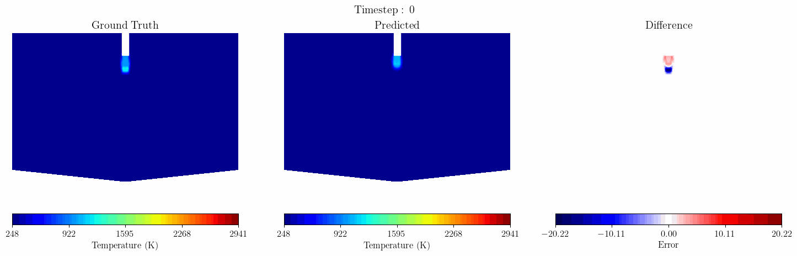
- **alphat**: 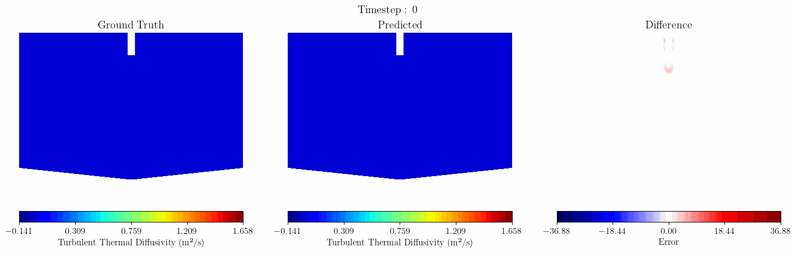
- **k**: 
- **nut**: 
- **omega**: 
- **p**: 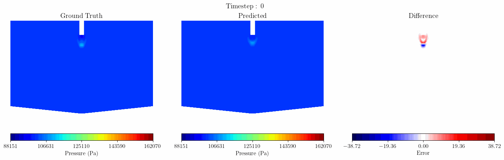
- **rho**: 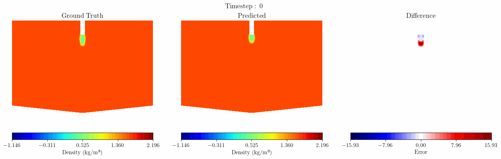
- **u**: 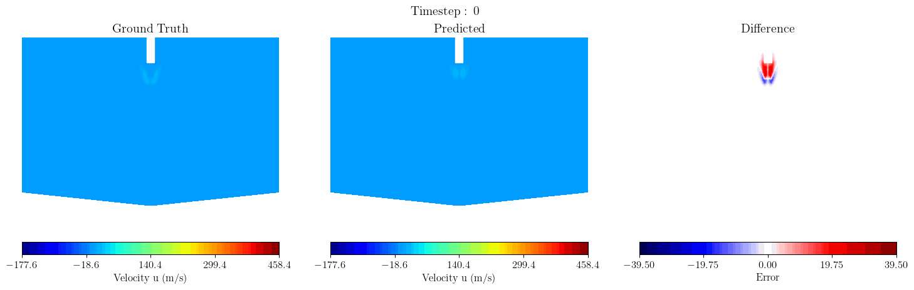
- **v**: 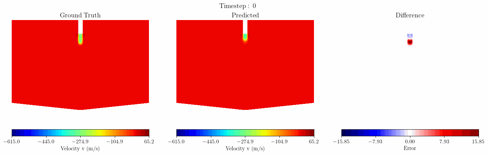
- **w**: 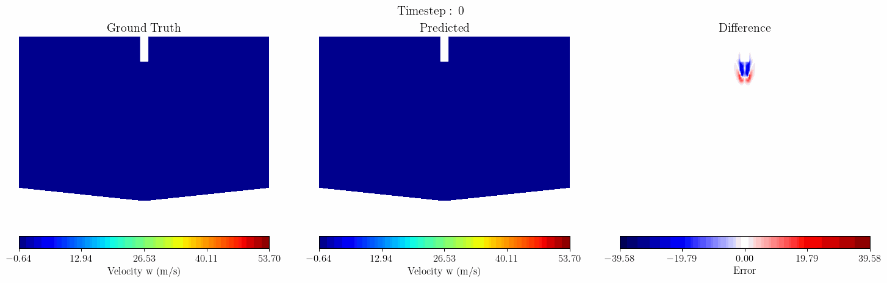

### **A91_In3_Sym42_Msh1.0_T924_U213**
- **p**: 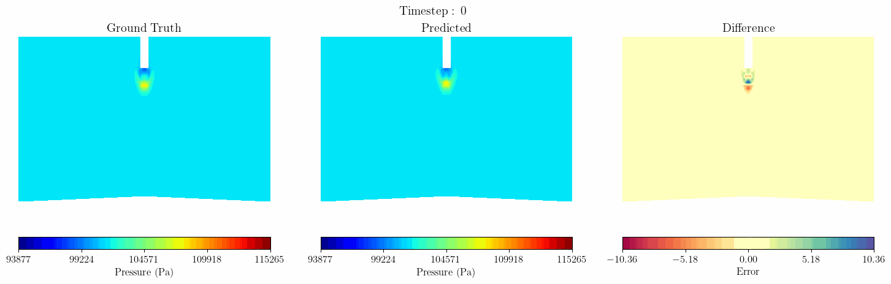
- **rho**: 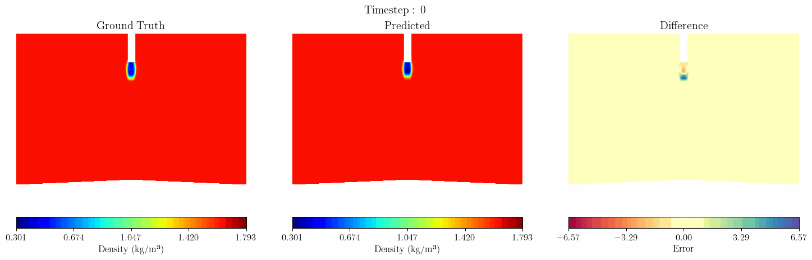

### **A94_In3_Sym57_Msh1.0_T845_U111**
- **T**: 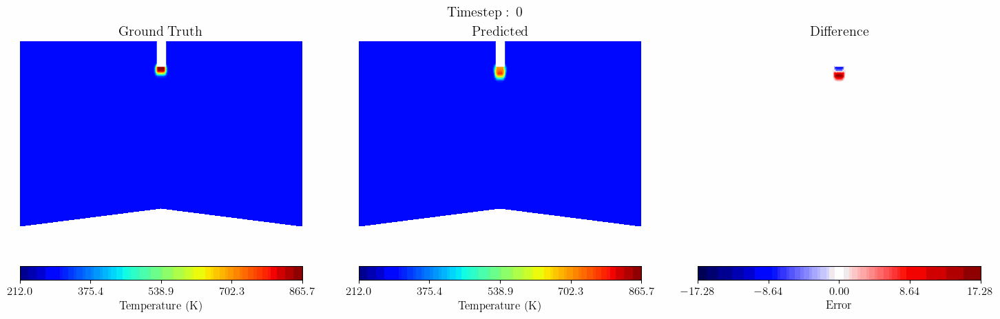
- **alphat**: 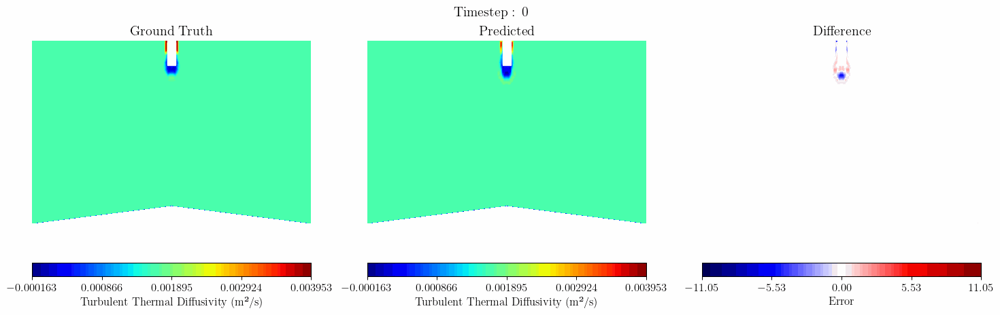
- **k**: 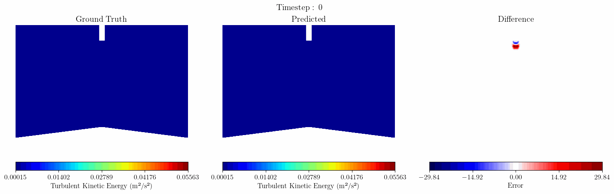
- **nut**: 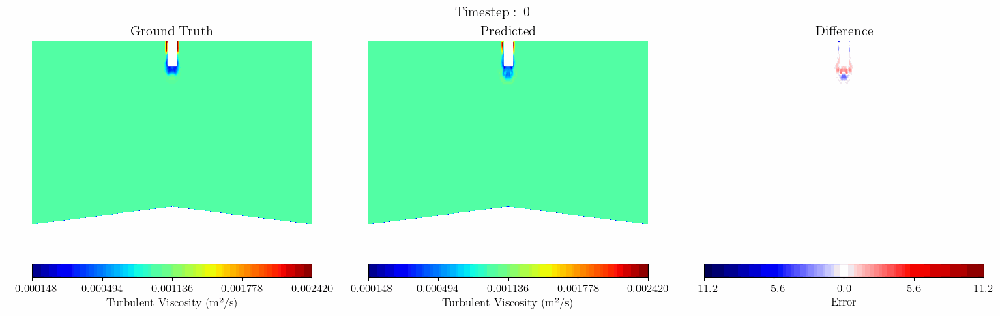
- **omega**: 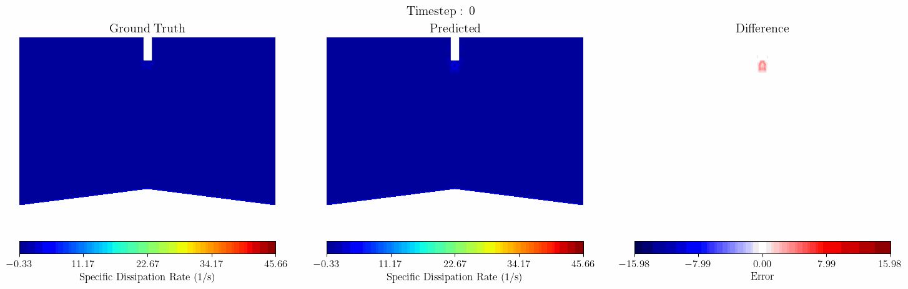
- **p**: 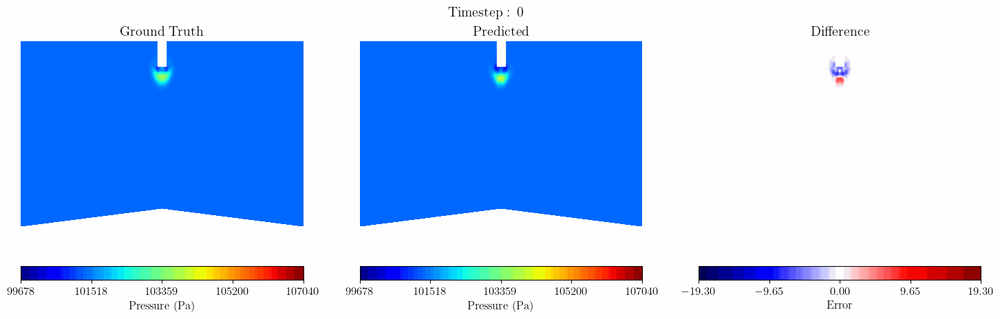
- **rho**: 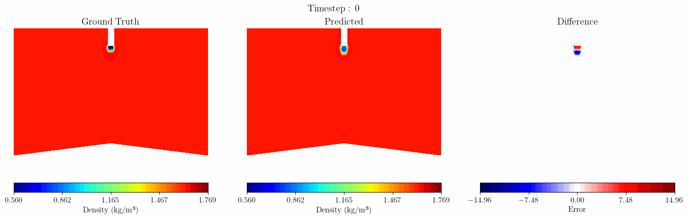
- **u**: 
- **v**: 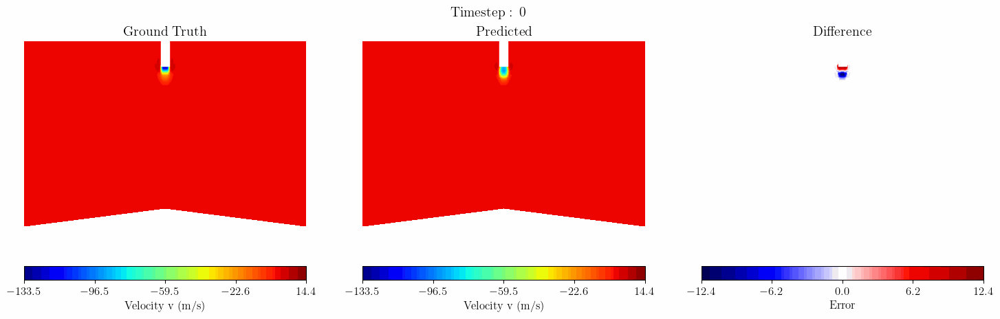
- **w**: 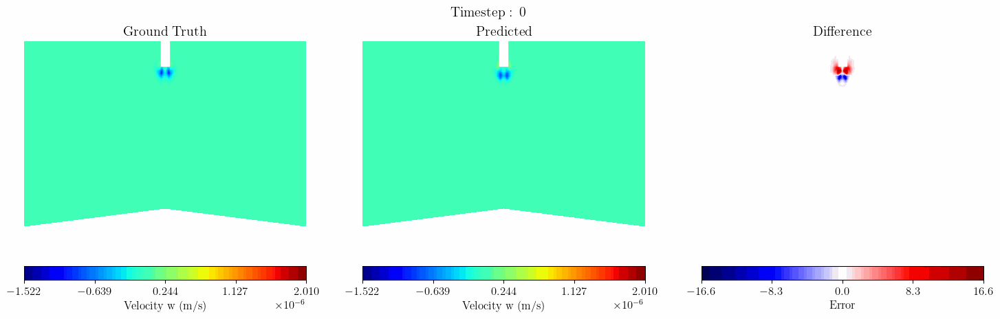

### **A99_In4_Sym42_Msh1.5_T824_U215**
- **T**: 
- **alphat**: 
- **k**: 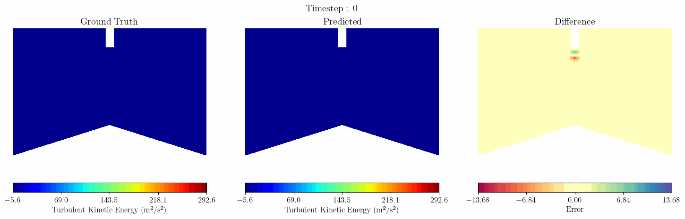
- **nut**: 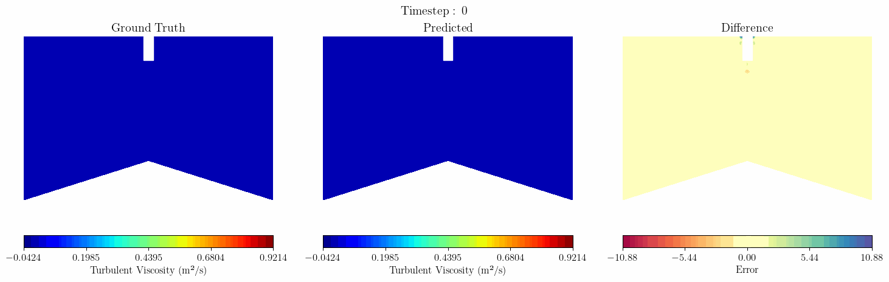
- **omega**: 
- **p**: 
- **rho**: 
- **u**: 
- **v**: 
- **w**: 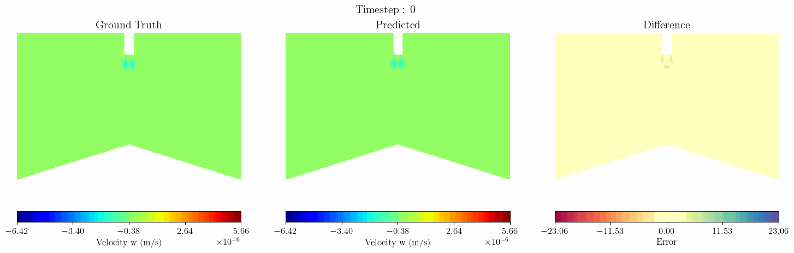
