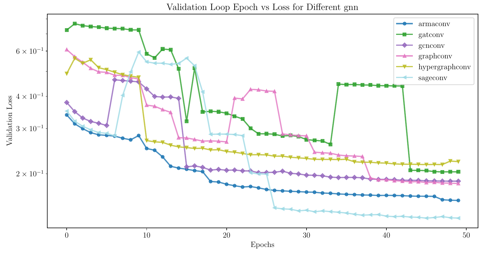

# Accelerating Homann Flow Simulation with Mesh-Based Graph Neural Networks

## Abstract

The numerical simulation of Homann flow, a classical problem in fluid dynamics involving axisymmetric flow over a solid plate, is essential for understanding various boundary layer phenomena. Due to the prominence of this flow and its computationally intense nature when dealing with complex geometries, the present paper explores the use of machine learning (ML) to solve Homann flow with heat transfer potentially fast and accurately.

However, applying ML, especially deep learning (DL), to engineering-focused physics simulations has been a significant challenge. Traditional numerical approaches have consistently demonstrated higher accuracy and lower error rates in simulation tasks compared to DL models, which often suffer from a lack of generalizability when predicting outcomes for geometries that differ slightly from those used in training.

In this study, Graph Neural Networks (GNNs) are employed to solve thermal Homann Flow on substrates of various geometries. We demonstrate that the trained model accurately predicts outcomes even on entirely novel cases, and notably, the computational efficiency of the GNN model surpasses that of conventional numerical solvers.

**Keywords**: Graph Neural Network, Mesh-Based Simulation, Computational Fluid Dynamics, Homann Flow

---

## Numerical Simulation

### Fluid Flow Governing Equations


*Figure 1: Schematic of the Homann Flow geometry used for CFD simulation.*


The numerical simulation consists of a compressible flow impacting a substrate at different angles. The high-speed flow is issued from a nozzle and impacts the substrate, which can have different geometries: flat or inclined at various angles (Figure 1). The fluid consists of argon in line with thermal spray processes. The thermophysical properties of the fluid are given in Table 1.

**Table 1: Properties of Argon at Room Temperature (293 K)**

| Property                      | Value                              |
|-------------------------------|------------------------------------|
| Molar Weight ($M$)            | 39.95 g/mol                        |
| Specific Heat ($C_p$)         | 519.3 J/(kg·K)                     |
| Dynamic Viscosity ($\mu$)     | $2.125 \times 10^{-5}$ kg/(m·s)    |
| Prandtl Number (Pr)           | 0.71                               |

**Table 2: Simulation Parameters and Their Ranges**

| Parameter                | Range                              |
|--------------------------|------------------------------------|
| Angle                    | 80°, 85°, 90°, 95°, 100°           |
| Inlet Diameter           | 3 mm, 4 mm, 5 mm                   |
| Distance from Nozzle     | 40 mm, 60 mm, 80 mm                |
| Maximum Mesh Size        | 1 mm, 1.5 mm, 2 mm                 |
| Inlet Temperature        | 600 K, 800 K, 1000 K               |
| Inlet Velocity           | 100 m/s, 200 m/s, 300 m/s          |

#### Mass Conservation
$$
\frac{\partial \rho}{\partial t} + \nabla \cdot (\rho \mathbf{U}) = 0
$$

#### Momentum Conservation

$$
\frac{\partial (\rho \mathbf{U})}{\partial t} + \nabla \cdot (\rho \mathbf{U} \mathbf{U}) = - \nabla p + \nabla \cdot \boldsymbol{\tau} + \rho \mathbf{g}
$$

where $\mathbf{U}$ represents the velocity, $\rho$ the density, and the shear stress tensor $\boldsymbol{\tau}$ is given by:

$$
\boldsymbol{\tau} = \mu \left( \nabla \mathbf{U} + \nabla \mathbf{U}^\top - \frac{2}{3} (\nabla \cdot \mathbf{U}) \mathbf{I} \right) + \mu_t (\nabla \cdot \mathbf{U})
$$

with $\mu$ being the dynamic viscosity, $\mu_t$ the turbulent viscosity, and $\mathbf{I}$ the identity matrix.

#### Energy Conservation

For compressible flows with high speeds or significant temperature gradients, the enthalpy ($h$) formulation is adopted:

$$
\frac{\partial (\rho h)}{\partial t} + \nabla \cdot (\rho \mathbf{U} h) + \frac{\partial (\rho K)}{\partial t} + \nabla \cdot (\rho \mathbf{U} K) - \frac{\partial p}{\partial t} = - \nabla \cdot \mathbf{q} + \nabla \cdot (\boldsymbol{\tau} \cdot \mathbf{U}) + \rho \mathbf{g} \cdot \mathbf{U}
$$

where:

- $K = \frac{|\mathbf{U}|^2}{2}$ is the specific kinetic energy.
- $\mathbf{q} = -\alpha_{\text{eff}} \nabla T$ is the heat flux.
- $\alpha_{\text{eff}}$ is the effective thermal diffusivity.

#### Turbulence Model

We adopted the $k$- $\omega$ Shear Stress Transport (SST) turbulence model \[1\], which combines the strengths of both the $k$ - $\omega$ model near walls and the $k$- $\epsilon$ model in the free-stream.

The transport equation for the turbulence kinetic energy $k$:

$$
\frac{\partial (\rho k)}{\partial t} + \nabla \cdot (\rho \mathbf{U} k) = \nabla \cdot \left[(\mu + \mu_t \sigma_{k}) \nabla k \right] + P_k  - \beta^* \rho \omega k
$$

The transport equation for the specific dissipation rate $\omega$:

$$
\begin{split}
\frac{\partial(\rho \omega)}{\partial t} + \nabla \cdot (\rho \mathbf{U} \omega) &= \nabla \cdot \left[(\mu + \mu_t \sigma_{\omega}) \nabla \omega \right] + \frac{\lambda}{v_t}P_k - \beta \rho \omega^2 \\
&\quad + 2(1-F_1)\frac{\rho \sigma_{\omega 2}}{\omega} \nabla k : \nabla \omega
\end{split}
$$

The blending function $F_1$ is used to transition between models:

$$
F_1 = \tanh(\text{arg}_1^4)
$$

Details of the model parameters can be found in \[1\].

---

## OpenFOAM Setup


*Figure 2: CFD simulation procedure using Salome, OpenFOAM, and Paraview. Yellow boxes represent hyperparameters, blue boxes are saved outputs, and red boxes denote processes.*
### Boundary Conditions

The geometry consists of eight boundaries, each requiring specific conditions. Two boundaries are defined as wedges, representing a symmetric domain. There are two outlet boundaries treated as farfield conditions with atmospheric pressure and temperature, and zero flow velocity. No specific constraints are imposed on the turbulent variables at the outlets.

At the inlet boundary, fixed velocity and temperature values are assigned. The turbulent variables at the inlet are calculated based on flow conditions. For the nozzle and main wall boundaries, pressure and temperature gradients are set to zero, and a no-slip condition is applied for velocity.

**Table 2: Summary of boundary values and types for the OpenFOAM case setup**

| Quantity (Symbol)                      | Parameter           | Outlets (Patch)       | Walls (Wall)             | Inlet (Patch)          |
|----------------------------------------|---------------------|-----------------------|--------------------------|------------------------|
| **$\alpha$ (Thermal Diffusivity)**     | Type                | Calculated            | Alphat Wall Function     | Zero Gradient          |
|                                        | Value               | 0                     | 0                        | -                      |
| **$k$ (Turbulent Kinetic Energy)**     | Type                | InletOutlet           | Zero Gradient            | InletOutlet            |
|                                        | Value               | $1 \times 10^{-3}$    | $1 \times 10^{-3}$       | $1 \times 10^{-3}$     |
| **$\mu_t$ (Turbulent Viscosity)**      | Type                | Calculated            | Nutk Wall Function       | Calculated             |
|                                        | Value               | 0                     | 0                        | 0                      |
| **$\omega$ (Specific Dissipation Rate)** | Type              | InletOutlet           | Omega Wall Function      | InletOutlet            |
|                                        | Value               | 1                     | 1                        | 1                      |
| **$p$ (Pressure)**                     | Type                | Free Stream           | Zero Gradient            | Zero Gradient          |
|                                        | Value               | 101325 Pa             | -                        | -                      |
| **$T$ (Temperature)**                  | Type                | InletOutlet           | Zero Gradient            | Fixed Value            |
|                                        | Value               | 298 K                 | -                        | $T_{\text{inlet}}$     |
| **$\mathbf{u}$ (Velocity)**            | Type                | Free Stream           | No Slip                  | Fixed Value            |
|                                        | Value               | (0, 0, 0)             | -                        | $U_{\text{inlet}}$     |

### Discretization Schemes

**Table 3: Summary of the discretization schemes used for governing equations**

| Terms                                                       | Discretization Schemes                   |
|-------------------------------------------------------------|------------------------------------------|
| $\nabla \phi$                                               | Gauss Linear                             |
| $\nabla \mathbf{U}$, $\nabla k$, $\nabla \omega$            | Cell Limited Gauss Linear 1              |
| $\nabla \cdot (\phi \mathbf{U})$, $\nabla \cdot (\phi h)$, $\nabla \cdot (\phi K)$ | Bounded Gauss linearUpwind limited |
| $\nabla \cdot (\phi k)$, $\nabla \cdot (\phi \omega)$       | Bounded Gauss Upwind                     |

### Solver Tolerances

**Table 4: Solver tolerances and relaxation factors**

| Variable                | Tolerance          | Relative Tolerance | Residual Control    | Relaxation Factors |
|-------------------------|--------------------|--------------------|---------------------|--------------------|
| $p$ (Pressure)          | $1 \times 10^{-8}$ | 0.01               | $1 \times 10^{-6}$  | 0.1                |
| $\mathbf{u}$, $k$, $\omega$, $h$ | $1 \times 10^{-10}$ | 0.01               | $1 \times 10^{-5}$  | 0.5                |
| $\rho$ (Density)        |                    |                    |                     | 0.01               |

---

## GNN Setup

### GNN Architecture and Optimization Strategy

Graph Neural Networks (GNNs) were applied to predict flow variables by converting mesh data into graph structures. Our model incorporated skip connections to facilitate gradient flow during training and normalization layers to stabilize training by scaling inputs.

We tested various GNN architectures, including Graph Convolutional Networks (GCNConv), Graph Attention Networks (GATConv), and GraphSAGE. The models consist of multiple GNN layers followed by linear layers to generate the final predictions.

### Hyperparameter Optimization

**Table 6: Parameter ranges explored during hyperparameter optimization**

| Parameter                  | Range                                                                                       |
|----------------------------|---------------------------------------------------------------------------------------------|
| Graph Neural Network       | GCNConv, GATConv, SAGEConv, GraphConv, ArmaConv, HyperGraphConv                             |
| Activation Function        | ReLU, ELU, Leaky ReLU, SELU, GELU, SiLU, Softsign, Sigmoid, Tanh, Tanhshrink                |
| Skip Connection            | True, False                                                                                 |
| Normalize Output           | True, False                                                                                 |
| Number of GNN Layers       | 2 to 12                                                                                     |
| Number of Linear Layers    | 1 to 5                                                                                      |
| Hidden Dimension           | 4 to 128 (step size = 4)                                                                    |

We used early stopping during training to prevent overfitting. The dataset was split into training and validation sets in an 80:20 ratio. Root Mean Square Error (RMSE) was chosen as the loss function.

**Table 7: Summary of Training Procedure**

| **Procedure Component**     | **Description**                       |
|-----------------------------|---------------------------------------|
| Input Standardization       | Standard Scaler                       |
| Optimizer                   | Adam optimizer                        |
| Initial Learning Rate       | 0.01                                  |
| Learning Rate Scheduler     | Reduce when validation plateaus       |
| Epochs                      | Max: 100                              |
| Early Stopping              | Stop if no improvement for 10 epochs  |
| Split                       | Training: 80%                         |
|                             | Validation: 20%                       |
| Loss Function               | RMSE                                  |
| Data Shuffling              | Training: Shuffled each epoch         |
|                             | Validation: Not shuffled              |

---

## Results

### Data Generation and Analysis from Numerical Simulations

The numerical simulations consist of 150 cases, and the residuals for each case were computed. The plots in Figure 2 summarize the mean residual values for all cases, including variables such as pressure ($p$), $x$-velocity ($U_x$), $y$-velocity ($U_y$), enthalpy ($h$), turbulent kinetic energy ($k$), and specific dissipation rate ($\omega$). The shaded regions in the graphs represent the mean plus or minus the standard deviation, while the lighter colored areas indicate the range between the minimum and maximum values.

As shown in Figure 2a, the residuals for velocity and enthalpy steadily decrease over time as the simulation progresses. In contrast, the pressure residuals exhibit notable fluctuations during the initial time steps, with minor oscillations persisting throughout the simulation without significant improvement. This behavior is typical in high-temperature compressible flows, where variations in density are tightly coupled with changes in pressure and temperature.

For the $k$-$\omega$ SST model residuals, as illustrated in Figure 2b, both $k$ and $\omega$ demonstrate a steady decrease over time, indicating effective turbulence modeling with the $k$-$\omega$ SST approach, maintaining stability and consistency in the residuals.


*Figure 2: (a) Summary of all CFD case residuals for Pressure, Velocity, and Enthalpy; (b) Summary of all CFD case residuals for $k$-$\omega$ SST model.*

### Mesh Analysis

Figure 3 presents a detailed mesh analysis examining the relationship between the number of mesh cells, total mesh volume, maximum cell volume, and CFD simulation execution time. Figure 3a illustrates a direct correlation between the number of mesh cells and execution time, where an increase in cell count leads to longer computation times. Similarly, Figure 3b shows that execution time increases with the total mesh volume.


*Figure 3: (a) Number of mesh cells vs. execution time, colored by mesh size; (b) Execution time vs. total mesh volume, colored by mesh size.*

### GNN Model Training, Testing, and Hyperparameters Optimization

The training and optimization of GNNs play a crucial role in achieving optimal performance for complex tasks. Using a combination of hyperparameter search algorithms, we systematically explored different configurations to identify the models that offer the best trade-off between accuracy and computational efficiency.

**Table 8: Top 10 models and their hyperparameters**

| **Min Validation Loss** | **No. of GNN Layers** | **No. of Linear Layers** | **Activation Function** | **GNN Layer Type** | **Linear Layer Dimension** | **Normalization Layer?** | **Skip Connections?** |
|-------------------------|-----------------------|--------------------------|-------------------------|--------------------|----------------------------|--------------------------|-----------------------|
| 0.1110                  | 11                    | 1                        | Leaky ReLU              | GATConv            | 124                        | True                     | True                  |
| 0.1113                  | 3                     | 1                        | Leaky ReLU              | SageConv           | 124                        | False                    | True                  |
| 0.1118                  | 5                     | 1                        | ELU                     | SageConv           | 124                        | False                    | True                  |
| 0.1127                  | 4                     | 1                        | Leaky ReLU              | SageConv           | 116                        | True                     | True                  |
| 0.1131                  | 12                    | 1                        | GeLU                    | ArmaConv           | 124                        | True                     | True                  |
| 0.1132                  | 9                     | 1                        | Leaky ReLU              | SageConv           | 124                        | True                     | True                  |
| 0.1132                  | 4                     | 1                        | Leaky ReLU              | SageConv           | 108                        | True                     | True                  |
| 0.1133                  | 5                     | 5                        | SeLU                    | SageConv           | 124                        | False                    | False                 |
| 0.1137                  | 4                     | 1                        | Leaky ReLU              | SageConv           | 108                        | True                     | True                  |
| 0.1137                  | 4                     | 1                        | Leaky ReLU              | SageConv           | 116                        | True                     | True                  |

Most models utilize Leaky ReLU as the activation function. The best model architecture features a Graph Attention Network (GAT) with Leaky ReLU activation. It includes 11 GNN layers, each with output normalization to ensure stable gradient flow during training. The model architecture also includes a single linear layer for final output processing, and skip connections to improve information flow across layers.

**Feature Importance Analysis**

Figure 4 compares feature importance for the GNN model architectures using the Functional ANOVA (fANOVA) and Mean Decrease Impurity (MDI) methods. Both methods consistently identify the activation function and the number of GNN layers as the most influential hyperparameters. fANOVA places slightly more emphasis on GNN layer type, while MDI gives higher importance to the dimension and number of linear layers. Both methods rank the normalization layer and skip connections lower in importance.


*Figure 4: GNN Model Architecture Feature Importance.*

**Model Performance Analysis**

Figure 5 demonstrates that model performance improves with the number of parameters, up to a certain threshold. Skip connections exhibit a more pronounced impact on larger models, while output normalization primarily contributes to stabilizing the learning process.


*Figure 5: (a) Performance vs. parameters, colored by output normalization; (b) Performance vs. parameters, colored by skip connection presence.*

Figure 6 compares validation loss trends for different activation functions and GNN architectures. ELU and Leaky ReLU demonstrate the most stable and effective performance, while tanhshrink exhibits unstable trends. GATConv layers experience more fluctuations, whereas ARMA and SageConv layers display smoother and more stable learning processes.



*Figure 6: (a) Activation function validation loss over epochs; (b) GNN architecture validation loss over epochs.*

### CFD Simulation vs. GNN Model Prediction

We compare here the performance of the traditional CFD solver with the GNN model predictions in terms of accuracy and computational efficiency. We analyze the differences in predicted values for key variables such as pressure, temperature, and density, as well as the time savings offered by the GNN model.


*Figure 7: Temperature field comparison at different timesteps.*

**Performance Metrics**

**Table 9: Summary of simulation parameters and performance metrics**

| **Angle** | **Inlet Diameter [mm]** | **Distance from Substrate [mm]** | **Mesh Size [mm]** | **Inlet Temperature [K]** | **Velocity [m/s]** | **Cells** | **Loss**  | **GNN Prediction Time [s]** | **CFD Execution Time [s]** | **CFD/GNN Time Factor** |
|-----------|-------------------------|----------------------------------|--------------------|---------------------------|--------------------|-----------|----------|----------------------------|----------------------------|-------------------------|
| 82        | 3                       | 49                               | 1                  | 670                       | 169                | 5806      | 0.0186   | 0.719                      | 149.89                     | 208.19                  |
| 82        | 3                       | 49                               | 2                  | 916                       | 164                | 1646      | 0.0184   | 0.671                      | 57.25                      | 85.31                   |
| 82        | 4                       | 62                               | 2                  | 986                       | 176                | 1980      | 0.0097   | 0.670                      | 59.18                      | 88.24                   |
| 84        | 4                       | 61                               | 1.5                | 974                       | 198                | 3407      | 0.0049   | 0.670                      | 92.01                      | 137.31                  |
| 86        | 3                       | 46                               | 1.5                | 769                       | 199                | 2771      | 0.0196   | 0.670                      | 72.95                      | 108.77                  |
| 86        | 3                       | 78                               | 1                  | 768                       | 190                | 9207      | 0.0111   | 0.885                      | 224.93                     | 253.99                  |
| 87        | 4                       | 61                               | 1                  | 843                       | 184                | 7586      | 0.0066   | 0.812                      | 194.25                     | 239.17                  |
| 91        | 3                       | 42                               | 1                  | 924                       | 213                | 5944      | 0.0124   | 0.726                      | 157.54                     | 216.81                  |
| 94        | 3                       | 57                               | 1                  | 845                       | 111                | 7772      | 0.0472   | 0.824                      | 205.33                     | 249.11                  |
| 99        | 4                       | 42                               | 1.5                | 824                       | 215                | 3179      | 0.0245   | 0.667                      | 84.65                      | 126.78                  |

**Temporal Evolution of Prediction Accuracy**

Figure 8 illustrates the temporal evolution of the model's predictive accuracy. Initially, the model exhibits a relatively high loss at timestep 0, followed by a rapid decrease within the first few timesteps. As the simulation continues, the mean loss decreases gradually, reflecting the model’s growing ability to predict subsequent timesteps more accurately.


*Figure 8: Average test loss vs. timestep.*

**Computational Efficiency Comparison**

Figure 9 highlights the substantial time savings achieved by the GNN model compared to traditional CFD simulations. In Figure 9a, it is evident that the execution time for CFD simulations increases almost linearly with the number of mesh cells, whereas the GNN prediction time remains almost constant. Figure 9b shows that the ratio of CFD execution time to GNN prediction time increases with mesh complexity, underscoring the growing time efficiency of the GNN model.


*Figure 9: (a) GNN prediction time and CFD execution time vs. number of mesh cells; (b) Ratio of CFD execution time to GNN prediction time vs. mesh cell count.*


*Figure 9: (b) Ratio of CFD execution time to GNN prediction time vs. mesh cell count.*


---

### CFD simulation  vs GNN model contour prediction
Each case name follows the format:
`A[Angle]_In[Inlet Size]_Sym[Distance from Nozzle (mm)]_Msh[Mesh Size (mm)]_T[Inlet Temperature (°C)]_U[Inlet Velocity (m/s)]`.

- **A**: Angle (e.g., A90 means 90°)
- **In**: Inlet size (e.g., In3 means inlet size 3)
- **Sym**: Distance from nozzle in mm (e.g., Sym40 means 40mm)
- **Msh**: Mesh size in mm (e.g., Msh1 means mesh size is 1mm)
- **T**: Inlet temperature in °C (e.g., T200 means 200°C)
- **U**: Inlet velocity in m/s (e.g., U100 means 100 m/s)
- The final part of the file name represents a parameter (`p`, `u`, `v`, etc.)

## GIF Categories by Case Name:

### **A80_In3_Sym40_Msh1**
- **T**: 
- **p**: 
- **rho**: 
- **u**: 
- **v**: 

### **A86_In3_Sym46_Msh1.5_T769_U199**
- **T**: 
- **p**: 
- **rho**: 
- **u**: 
- **v**: 


### **A99_In4_Sym42_Msh1.5_T824_U215**
- **T**: 
- **p**: 
- **rho**: 
- **u**: 
- **v**: 

---


## Conclusion

In this work, we demonstrated the potential of GNNs to accelerate Homann flow simulations by effectively predicting flow variables on mesh-based data. The proposed GNN models not only achieved high accuracy but also significantly reduced computational time compared to traditional CFD methods.

---

## How to Cite Us

**D. Rahmat Samii and M. Tembely, "Accelerating Thermal Homann Flow Simulation With Mesh-Based Graph Neural Networks," in IEEE Access, vol. 13, pp. 100271-100286, 2025, doi: 10.1109/ACCESS.2025.3577098.
**
```
@ARTICLE{11025840,
  author={Rahmat Samii, Dara and Tembely, Moussa},
  journal={IEEE Access}, 
  title={Accelerating Thermal Homann Flow Simulation With Mesh-Based Graph Neural Networks}, 
  year={2025},
  volume={13},
  number={},
  pages={100271-100286},
  doi={10.1109/ACCESS.2025.3577098}}
```
